# LangChain and LangGraph

**LangChain** is an open-source framework designed to simplify the process of building LLM-based applications. It provides modular building blocks for conversational applications, text summarization, multi-step workflows, RAG applications, and agents. Common components include:
- **Models**: Provide a unified interface for interacting with different LLM providers.
- **Prompts**: Help you design and manage instructions sent to models.
- **Retrievers**: Fetch relevant documents or passages from a knowledge base.
- **Chains**: Link components together into a sequence or workflow.

**LangGraph** is an orchestration framework for building `stateful`, `multi-step`, and `event-driven` workflows with LLMs. It is useful for both `single-agent` and `multi-agent` applications. LangGraph is similar to a flowchart engine: you define the steps as `nodes`, connect them with `edges`, and define the logic that controls transitions. It supports state management, conditional branching, loops, pausing and resuming, and persistence for recovery.

## LangChain vs. LangGraph
LangChain commonly provides the components and abstractions used to build applications, while LangGraph provides graph-based orchestration for workflows that need explicit state, branching, loops, persistence, or human-in-the-loop steps. LangChain applications can also be stateful, and LangGraph applications can use LangChain components; the two frameworks are complementary rather than mutually exclusive.

LangChain is often used for `simple`, linear workflows such as a prompt chain, summarizer, or basic retrieval system. LangGraph is useful for `complex`, non-linear workflows that need conditional paths, loops, human-in-the-loop steps, multi-agent coordination, event-driven execution, or persistence. A LangGraph application defines a state object, often with `TypedDict` or Pydantic, and nodes read and return state updates.

### Important differences
- **Execution**: A LangChain chain is often linear, while a LangGraph workflow can branch, loop, pause, and resume based on state.
- **State and persistence**: LangGraph can use checkpointers to persist intermediate state and resume execution. `workflow.get_state_history(config)` can inspect prior states when a checkpointer is configured.
- **Human-in-the-loop**: LangGraph has explicit primitives for interrupting a workflow, waiting for human input, and resuming it. LangChain components can also be used in human-in-the-loop systems, but the orchestration must be implemented by the application.
- **Nested workflows**: A compiled graph can be used as a node in another graph. This supports modularity, failure isolation, state separation, multi-agent systems, reusability, and observability.

#### Subgraph with shared state
```python
# Add a graph as node has common state

subgraph_builder = StateGraph(SubState)
subgraph_builder.add_node('translate_text', translate_text)
subgraph_builder.add_edge(START, 'translate_text')
subgraph_builder.add_edge('translate_text', END)
subgraph = subgraph_builder.compile()

parent_builder = StateGraph(ParentState)
parent_builder.add_node("answer", generate_answer)
parent_builder.add_node("translate", translate_answer) # translate_answer function contains subgraph.invoke()
parent_builder.add_edge(START, 'answer')
parent_builder.add_edge('answer', 'translate')
parent_builder.add_edge('translate', END)
```

```python
# Invoke a graph from a node with separate state

subgraph_builder = StateGraph(ParentState)
subgraph_builder.add_node('translate_text', translate_text)
subgraph_builder.add_edge(START, 'translate_text')
subgraph_builder.add_edge('translate_text', END)
subgraph = subgraph_builder.compile()

parent_builder = StateGraph(ParentState)
parent_builder.add_node("answer", generate_answer)
parent_builder.add_node("translate", subgraph) # "translate" node of parent_builder run the subgraph
parent_builder.add_edge(START, 'answer')
parent_builder.add_edge('answer', 'translate')
parent_builder.add_edge('translate', END)
```
> **Note:** LangGraph is built on top of LangChain; it does not replace it. LangGraph handles workflow orchestration, while LangChain provides building blocks such as models, prompts, retrievers, document loaders, and tools.

### LLM workflows
LLM workflows are step-by-step processes used to build complex LLM applications. Each step in a workflow performs a distinct task—such as prompting, reasoning, tool calling, memory access, or decision-making. Workflows can be linear, parallel, branched, or looped, allowing for complex behaviors like retries, multi-agent communication, or tool-augmented reasoning. Common workflows include Prompt Chaining, Routing, Parallelization, Orchestrator Workers, and Evaluator Optimizer.

### State
State in LangGraph is the shared data that flows through a workflow. It holds the information passed between nodes as the graph runs.

### Reducers
Reducers define how updates from nodes are applied to shared state. Each state key can have its own reducer, which determines whether new data replaces, merges with, or is added to the existing value. For example, `add_messages` appends and updates messages instead of replacing the entire message history.


### Execution flow

You define the `state schema`, followed by the `nodes` (functions that perform tasks) and `edges` (connections between nodes). You call `.compile()` on the `StateGraph` to validate and prepare it for execution. You run the graph with `.invoke(initial_state)`. LangGraph passes the initial state to the entry node or nodes. Execution proceeds in `rounds` (super-steps). In each round, active nodes run and return state updates. Those updates are passed to downstream nodes, which become active in the next round. Execution stops when no nodes are active and no messages are in transit.

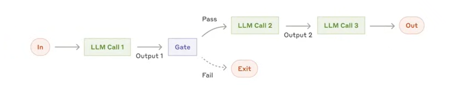 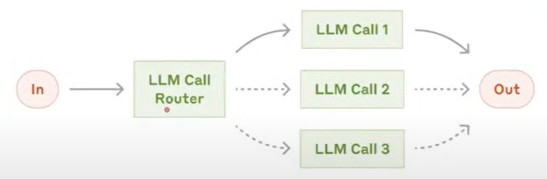
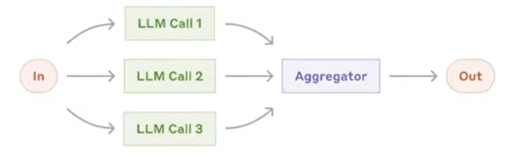 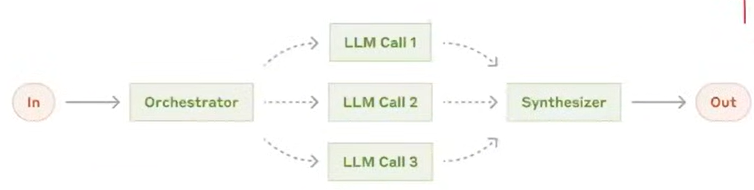
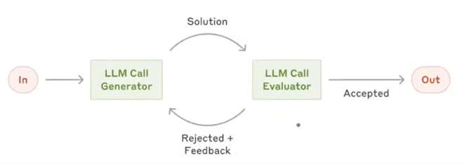

## Workflow patterns

### Sequential workflows
```python
graph.add_node('create_outline',create_outline)
graph.add_node('create_blog',create_blog)
graph.add_node('score_blog',score_blog)

graph.add_edge(START, 'create_outline')
graph.add_edge('create_outline', 'create_blog')
graph.add_edge('create_blog', 'score_blog')
graph.add_edge('score_blog', END)
```

### Parallel workflows
 NOTE: In parallel workflow, each nodes must return the required part of the state only. While, for others we can send the whole state. But, to keep it simple, we can just use required part of the state for nodes.

```python
graph.add_node("evaluate_language", evaluate_language)
graph.add_node("evaluate_analysis", evaluate_analysis)
graph.add_node("evaluate_thought", evaluate_thought)
graph.add_node("final_evaluation", final_evaluation)

graph.add_edge(START, "evaluate_language")
graph.add_edge(START, "evaluate_analysis")
graph.add_edge(START, "evaluate_thought")
graph.add_edge("evaluate_language", "final_evaluation")
graph.add_edge("evaluate_analysis", "final_evaluation")
graph.add_edge("evaluate_thought", "final_evaluation")
graph.add_edge("final_evaluation", END)
```

### Conditional workflows
```python
graph.add_node('find_sentiment', find_sentiment)
graph.add_node('positive_response', positive_response)
graph.add_node('run_diagnosis', run_diagnosis)
graph.add_node('negative_response', negative_response)

graph.add_edge(START, 'find_sentiment')
graph.add_conditional_edges('find_sentiment', check_sentiment) # check_condition will fit the correct function.

graph.add_edge('positive_response', END)

graph.add_edge('run_diagnosis', 'negative_response')
graph.add_edge('negative_response', END)
```

### Iterative workflows
```python
graph.add_node('generate_tweet', generate_tweet)
graph.add_node('evaluate_tweet', evaluate_tweet)
graph.add_node('optimize_tweet', optimize_tweet)

graph.add_edge(START, 'generate_tweet')
graph.add_edge('generate_tweet', 'evaluate_tweet')

graph.add_conditional_edges('evaluate_tweet', route_evaluation)

graph.add_edge('approved', END)

graph.add_edge('needs_improvement', 'optimize_tweet') # calling back the optimize_tweet function for iteration
graph.add_edge('optimize_tweet', 'evaluate_tweet')
```

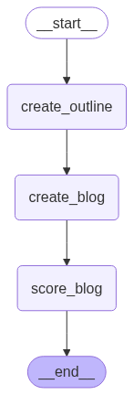 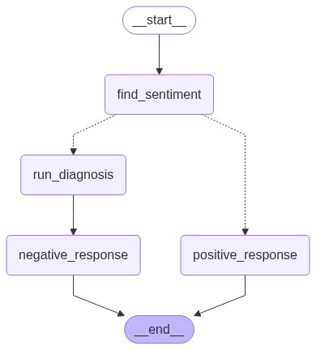 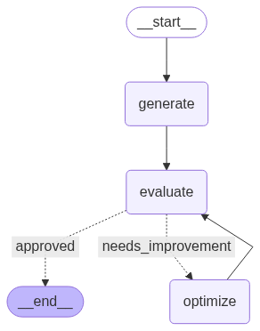

# Agentic AI

**Generative AI** refers to artificial intelligence models that can create new content—such as text, images, audio, video, or code—that resembles human-created data. Generative AI learns patterns in data and generates new samples, while traditional predictive AI generally uses learned patterns to classify or predict outcomes. Examples include ChatGPT, Code Llama, DALL·E, ElevenLabs, and Sora. Generative AI can produce general responses; RAG grounds responses in specific external data. Neither capability automatically provides memory or the ability to take actions: those capabilities must be implemented by the application.

**Agentic AI** uses generative AI, tools, memory, and workflow logic to work toward a user-defined goal with limited step-by-step guidance. It can plan, make decisions, call external APIs, adapt to new information, and request human approval before high-risk actions. For example, an agent can use a calendar or payment API to complete a task end to end, subject to the permissions and guardrails defined by the application.

## Features of agentic AI chatbots

### 1. Autonomy, adaptability, and goal orientation
**Autonomy** refers to the AI system's ability to make decisions, use tools, and take actions on its own to achieve a given goal, without needing step-by-step human instructions.

 **Goal-oriented** means AI system that understands user instructions and translates them into objectives and operates with a persistent objective in mind and continuously directs its actions to achieve that objective, rather than just responding to isolated prompts. Independently set subgoals and execute tasks toward a main objective.

**Adaptability** is the agent's ability to modify its plans, strategies, or actions in response to unexpected conditions, failures, external feedback, or changing goals while staying aligned with the goal.

 **Initiative taking**: Acts without waiting for user prompts (e.g., offering to do something based on context).
 **Session continuity**: Maintains context across sessions and resumes where left off.

To control autonomy:
- **Permission Scope** - Limit what tools or actions the agent can perform independently. (Can screen candidates, but needs approval before rejecting anyone.)
- **Human-in-the-Loop (HITL)** - Insert checkpoints where a human can approve, supervise, correct, or guide the system before it continues with high-risk actions. HITL pauses execution, saves the state, waits for human input, and resumes after receiving feedback. Common HITL patterns include action approval, output review or editing, ambiguity clarification, and escalation.
- **Override Controls** - Allow users to stop, pause, or change the agent's behaviour at any time. (pause screening command to halt resume processing.)
- **Guardrails / Policies** - Define hard rules or ethical boundaries the agent must follow and Blocks unsafe or non-compliant behavior. (Never schedule interviews on weekends)

### 2. Reasoning and planning (cognitive capabilities)

 **Reasoning** is the cognitive process through which an agentic ai system interprets information, draws conclusions, resolves ambiguity, evaluates trade-offs and makes decisions - both while planning ahead and while executing actions in real time. Chooses which tool(s) to use at a given step.

 **Planning** is the agent's ability to break down a high-level goal into a structured sequence of actions or ordered subgoals and decide the best path to achieve the desired outcome.

 **Reasoning During Planning**:

1. **Goal decomposition** - Break down abstract goals into concrete steps
2. **Tool selection** - Decide which tools will be needed for which steps
3. **Resource estimation** - Estimate time, dependencies, risks
4. **Multi-step task planning**: Breaks down complex tasks into logical sequences.
5. **Chain-of-thought reasoning or Logical chaining**: Explains steps in its decision-making.
6. **Constraint handling**: Considers limitations, deadlines, and conflicting objectives.

 **Reasoning During Execution**:

1. **Decision-making** - Choosing between options (3 candidates match → schedule 2 best, reject 1) 
2. **HITL handling** - Knowing when to pause and ask for help (Unsure about salary range)
3. **Error handling** - Interpreting tool/API failures and recovering

### 3. Tools
A **tool** is a Python function, API wrapper, or other callable packaged so an LLM can understand and request it. Tools are also runnables in LangChain. LLMs are good at reasoning and language generation, but they need tools to access live data, perform reliable calculations, call external APIs, run code, or interact with databases. The LLM proposes a tool call; the application or framework executes it. A clear tool description and input schema are essential because the model uses them to decide when and how to call the tool.

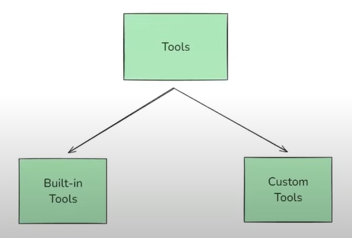 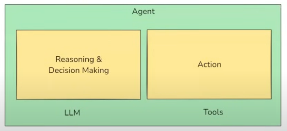

**Toolkits**: A toolkit is a collection of related tools that serve a common purpose, packaged for convenience and `reusability`. In LangChain, a toolkit might be `GoogleDriveToolkit` containing tools such as `GoogleDriveCreateFileTool` (upload a file), `GoogleDriveSearchTool` (search by name or content), and `GoogleDriveReadFileTool` (read file contents).

**Tool Binding** is the step where you register tools with a Language Model (LLM) so that the LLM knows what tools are available, what each tool does (via description) and what input format to use (via schema).

**Tool Calling** is the process where the LLM decides, during a conversation or task, that it needs to use a specific tool (external tools/APIs like search engines, calculators, databases, post a job, send an email, trigger onboarding etc.) and generates a structured output with the `name of the tool` and the `arguments` to call it with. The LLM `does not actually run the tool`, it just `suggests` the tool and the input arguments. The `actual execution is handled by LangChain or you`.

**ToolNode** in LangGraph, is a prebuilt node type that acts as a bridge between your graph and external tools (functions, APIs, utilities). Normally in LangGraph you'd write a node function yourself. It takes in state and returns state. It is a ready-made node that knows how to handle a list of LangChain tools. Its job is to listen for tool calls from the LLM like `call search()` or `get_weather()` and automatically route the request to the correct tool, then pass the tool's output back into the graph.

**tools_condition** is a prebuilt conditional edge function that helps your graph decide `Should the flow go to the ToolNode next, or back to the LLM?`

**Tool Execution** is the step where the `tool` is run using the input arguments that the **LLM suggested during tool calling**.

- **Built-in Tools**: A tool that is pre-built, production- ready, and requires minimal or no setup. You don't have to write the function logic yourself - you just import and use it. Example:- DuckDuckGoSearchRun and WikipediaQueryRun etc.

- **Custom Tools** : A tool that you define yourself. Example: calling custom APIs, encapsulate business logic, interact with your database, product, or app etc. Ways to create Custom Tools are @tool decorator, Structured Tool & Pydantic and Base Tool class.
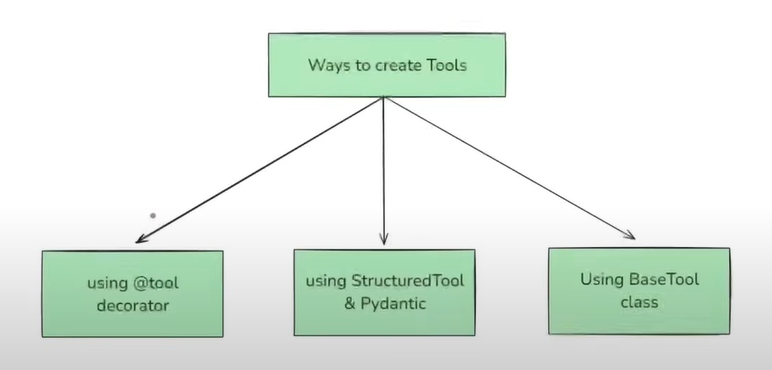 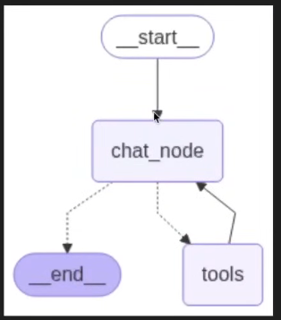

    - **Structured Tool** in LangChain is a tool whose input follows a structured schema, typically defined using a Pydantic model. Structured schemas enforce input types and constraints and are commonly used in production.

    - **BaseTool** is the abstract base class for LangChain tools. It defines the core structure and interface that a tool follows. The `@tool` decorator and structured tools provide simpler ways to create tools; `BaseTool` is useful when you need a customized implementation, including asynchronous execution.

**Model Context Protocol (MCP)** is an open standard for connecting AI applications to external data sources and tools such as databases, APIs, and files. It standardizes how a client discovers and invokes capabilities exposed by a server. This can reduce integration complexity from `N × M` custom connections toward `N + M` adapters.

MCP is useful because AI tools otherwise operate in silos, developers repeatedly assemble context, and integrations differ in authentication, data formats, API conventions, error handling, and security. An MCP server exposes tools or resources; an MCP client runs in the AI application and requests them. MCP may be used synchronously or asynchronously depending on the client and server implementation, so using MCP does not automatically require the entire chatbot to be asynchronous.

```python
client = MultiServerMCPClient(
    {
        "pubmed": { # To search biomedical literature
            "transport": "sse",  # Remote servers always use 'sse'
            "url": "https://pubmed.mcp.claude.com/sse"
        }
    }
)
```

**RAG** is a technique that combines information retrieval with language generation. A model retrieves relevant documents from a knowledge base and uses them as context to generate more grounded responses. RAG can help with outdated model knowledge, private data that was not in the model's training data, and hallucinations, but it cannot guarantee perfect accuracy or privacy.

A typical RAG pipeline loads documents, splits them into chunks, converts the chunks into vectors with an embedding model, and stores the vectors and their source text in a vector store such as FAISS or Chroma. For a user query, a retriever finds relevant chunks and passes them, together with the query, to the LLM for response generation. A system may reuse an existing index or rebuild it when the source content, file metadata, chunking parameters, or embedding model changes. Common RAG components are `Document Loaders`, `Text Splitters`, `Vector Stores`, and `Retrievers`.

**Document Loaders** are used to load data from various sources into a standardized format (usually as `Document objects`), which can then be used for chunking, embedding, retrieval, and generation. Most popular document loaders are `TextLoader`, `PyPDFLoader`, `WebBaseLoader`, `CSVLoader` etc. Also we can create a custom Document Loader (https://python.langchain.com/docs/how_to/document_loader_custom/).

- **TextLoader** reads only plain text `.txt` files and converts them into LangChain Document objects. Ideal for loading chat logs, scraped text, transcripts, code snippets, or any plain text data into a LangChain pipeline.

- **WebBaseLoader** loads and extract text content from web pages `URLs`. It uses BeautifulSoup under the hood to parse HTML and extract visible text (what's in the HTML, not what loads after the page renders). Used for blogs, news articles, or public websites where the content is primarily text-based and static. Doesn't handle JavaScript-heavy pages well (use SeleniumURLLoader for that).

- **DirectoryLoader** loads `multiple documents from a directory` of files.
- `**/*.txt`: All .txt files in all subfolders
- `*.pdf`: All .pdf files in the root directory
- `data/*.csv` : All .csv files in the data/ folder
- `**/*`: All files (any type, all folders)
- `**` = recursive search through subfolders

- **CSVLoader** loads `CSV files` into LangChain document objects - `one per row`, by default.

**load()**: loads `everything at once` (Eager Loading) into the memory and `returns a list of document objects`. Best when the number of documents is small. You want everything loaded upfront.

**lazy_load()**: loads `on demand` (Lazy Loading) and `returns a generator of document objects` and which is used to fetched one document object at a time as needed. Best when you're dealing with large documents or lots of files. You want to stream processing (e.g., chunking, embedding) without using lots of memory.

### 4. Observability and debugging with LangSmith
**Observability** is the ability to understand a system's internal state by examining its external outputs, like logs, metrics, and traces. It allows you to diagnose issues, understand performance, and improve reliability by analyzing data generated by the system. Essentially, it's about being able to `answer "why" something is happening within a system`, even if you didn't anticipate the problem. It helps `mitigate hallucination in RAG`, debugging in Agents, and latency in LLMs. Two big problems in LLMs/Agents/Chatbots are `Retriever errors` (wrong / irrelevant documents retrieved) and `Generator errors` (LLM hallucinates or misuses context). In production, it's often unclear if the retriever or LLM caused failure. This is why observability is critical.

**LangSmith** is a unified `observability & evaluation platform` where teams can `debug`, `test`, and `monitor AI app performance`. It tracks execution of application components step by step, capturing at a granular level what input and output each component receives and produces, and the time taken. In LangSmith, `an app` is called a **project**, each `execution` is a **trace**, and each `component’s execution` is called a **run**. LangSmith trace `Input and Output` (User query, LLM prompt (with inserted docs), Retrieved documents and LLM response), `All the intermediate steps`, `Latency`, `Token usage`, `Cost`, `Error`, `Tags`, `Metadata` (helps in search and debugging) and `Feedback`. LangSmith treats an LLM application as a workflow, which can be represented as a graph where each node represents a task. When graphs become complex, debugging and managing them is difficult — LangSmith solves this. Every graph execution is logged in LangSmith as a `trace`. Each node (retriever, LLM, tool call, subgraph, etc.) becomes a `run` inside the trace. If a workflow branches (conditional / parallel / subgraph), LangSmith records which path was executed. By default, LangSmith only tracks the LLM or chain invocation, not PDF loading, chunking, or embedding functions, this can be resolved using `@traceable decorator`. https://smith.langchain.com/

- **Monitoring and Alerting** in LangSmith looks across many traces at once to track the overall health of your LLM system. It aggregates metrics like `latency` (P50, P95, P99), `token usage`, `cost`, `error rates`, and `success rates`. Alerts can be configured to notify you when metrics drift outside acceptable ranges (e.g., `latency spikes`, `higher error rates`, `unexpected cost increases`, `Real-time status of agent`, `tools`, and `memory systems`). In production, issues often appear as patterns across multiple runs rather than in a single trace. Instead of waiting for customer complaints, LangSmith proactively alerts you when performance degrades, enabling faster responses and more reliable applications.

- **Evaluation** in LangSmith measures the quality of LLM outputs. You can `run tests against gold-standard datasets` or apply evaluation metrics like faithfulness, relevance, or completeness. Supported methods include `Automated scoring` (LLM-as-a-judge), `Semantic similarity checks`, `Custom Python evaluators`. Evaluations can run `offline` (batch, pre-deployment) or `online` (continuous on live traffic). LLM behavior is unpredictable (small changes in prompts, models, or retrieval may improve some cases but break others). Evaluation ensures objective, repeatable performance tracking, preventing regressions and validating improvements. For a RAG chatbot, you might evaluate Faithfulness (Are answers grounded in retrieved documents?) and Relevance (Did the response address the user’s question?) by running the same dataset across GPT-4, Claude, and LLaMA, you can compare models or pipeline setups.

- **Prompt Experimentation** LangSmith allows `A/B testing of different prompt versions`. Prompts are tested on the same dataset, evaluated against metrics, and results are logged over time. This builds a history of which prompts perform best under what conditions.

- **Dataset Creation & Annotation** Tools to build datasets for evaluation and fine-tuning. Supports manual annotation (e.g., labeling correctness). Stores versioned datasets for reuse across projects. High-quality datasets are essential for evaluation and feedback loops like Customer support (dataset of common Q&A for benchmarking RAG agent updates).

- **User Feedback Integration** Capture thumbs up/down, ratings, or structured feedback from production users directly impact agent scoring or future planning. Feedback is logged alongside traces, tied to prompts, models, and states. Enables bulk analysis of user preferences.

- **Collaboration** Team members can view, share, and comment on traces, datasets, and evaluations. Web UI enables non-engineers (PMs, QA, annotators) to inspect and annotate runs. Supports shared dashboards for experiments.

### 5. Context awareness
 **Context Awareness** is the agent's ability to understand, retain, and utilize relevant information from the ongoing task, past interactions, user preferences, and environmental cues to make better decisions throughout a multi-step process.

**Types of context** :
- **The original goal**
- **Progress till now + Interaction history** (Job description was finalized and posted to LinkedIn & GitHub Jobs)
- **Environment state** (Number of applicants so far = 8 or LinkedIn promotion ends in 2 days)
- **Tool responses** (Resume parser → "Candidate B has 3 years Django + AWS experience or Calendar API "No conflicts at 2 PM Wednesday)
- **User specific preferences** (Prefers remote-first candidates or Likes receiving interview questions in a Google Doc)
- **Policy or Guardrails**(Do not send offer without explicit user approval or Never use platforms that require paid ads unless approved)

**Persistence** in LangGraph refers to the ability to save and restore the state of a workflow over time. It not just store the initial and  final state but also the intermediate state. It is implemented with the help of **checkpointers**. **Threads** in Persistence helps by assigning Thread ID to each instance of the workflow to retrive that. **Time Travel** allow us to `re-play` or execute the workflow from `any intermediate checkpoint` when there is `no error or failure`. It helps in debugging. We first retrive the Checkpoint ID for a particular node by specifing node name then run workflow from the node. **Updating State** allow us to `re-play` the workflow `with new state` thus the output state will also change.

#### Types of memory
- **Short-term memory**: Stores intermediate state, such as recent user messages, tool calls, and immediate decisions, usually associated with a thread ID so a conversation can be resumed.
- **Long-term memory**: Stores user preferences, high-level goals, or past interactions to adjust future behavior. Examples include `episodic memory` (what happened), `semantic memory` (what is true), and `procedural memory` (how to do something).
- **State tracking**: Monitors progress, such as what is completed and what is pending (for example, "JD posted" or "Offer sent").

**Namespace**: A mechanism for organizing and isolating long-term memory data, such as user preferences, facts, or conversation summaries. Namespaces act like folders or unique identifiers in a database, helping keep data for different users or applications separate.

**Context window**: The maximum amount of text, measured in tokens, that an LLM can process in one request.

**Trimming**: If the messages exceed a configured token limit, the application keeps a suitable number of recent messages before sending the request to the LLM. This assumes that the latest messages are most relevant, but older context may be lost.

**Summarization**: The application summarizes older conversation history and sends the summary to the LLM instead of discarding that context entirely. Some systems replace older messages in state with the summary.

### 6. Other common chatbot features
* **Streaming**               Model starts sending tokens (words) as soon as they're generated, instead of waiting for the entire response to be ready before returning it. It has faster response time - low drop-off rates, mimics human like conversation (Builds trust, feels alive and keeps the user engaged), important for Multi-modal Uls, better UX for long output such as code, you can cancel midway saving tokens and you can interleave UI updates, e.g., show "thinking...", show tool results.
* **Quick Replies / Buttons** UI shortcuts to guide conversation.
* **Fallback Handling**       Gracefully manages unknown inputs ("Sorry, I didn’t understand").
* **FAQs Handling**           Responds instantly to predefined frequent questions.
* **Multichannel Support**    Works across web, WhatsApp, Messenger, etc.
* **Typing Indicators**       Shows bot is "typing" for realism.
* **Conversation Handoff**    Transfers to human when needed.
* **User Session Timeout**    Ends or resets inactive chats cleanly.
* **Language Detection**      Auto-detects and switches language if needed.
* **Small Talk**              Handles greetings, jokes, chit-chat.
* **Anonymity Option**        Can chat without needing personal data.

### 7. Agentic architecture and infrastructure support

* **Planning modules**: Components responsible for action sequencing and prioritization.
* **Critique/self-reflection modules or long-term adaptation**: Evaluates its own performance and revises plans.
* **High Availability & Fault Tolerance**: Distributed deployment to ensure no single point of failure, Auto-recovery from crashes or broken task chains, Retry mechanisms for failed steps or external API timeouts.
* **Scalability**: Supports dynamic workload scaling (horizontal/vertical), Multi-user and multi-agent orchestration without latency spikes.
* **Task Persistence & Resumability**: Can pause and resume long-running tasks (e.g., across sessions or after server restart), Tracks task state in a persistent store (e.g., Redis, vector DB, etc.).

### 8. Multi-agent systems

* **Task delegation**: Assigns subtasks to specialized agents.
* **Collaboration protocols**: Communicates and negotiates between agents.
* **Shared memory/context**: Maintains a common knowledge base across agents.
* **Multi-agent Task Arbitration**: Agents can negotiate or vote on decisions, Conflict resolution protocols (e.g., consensus, majority, rule-based overrides).

### 9. Operations and lifecycle management

* **Versioning & Rollbacks**: Tracks versions of agents, tools, prompts, and plans, Can revert to previous configurations or workflows if issues arise.
* **Dynamic Agent Configuration**: Allows real-time agent behavior tuning (e.g., temperature, planning depth, etc.) via UI or API, Agents can be upgraded, disabled, or redirected on the fly.
* **Hot-Swapping Skills/Tools**: Dynamically load/unload plugins/tools/APIs, Auto-discover or fetch new capabilities from registries or repositories.

### 10. Agent collaboration and governance

* **Agent Hierarchies and Delegation Policies**: Agents can spawn or command sub-agents with scoped permissions, Parent-child agent task hierarchies for traceability and control.
* **Agent Registry and Metadata**: Central registry of available agents with descriptions, capabilities, and usage metrics.

### 11. Adaptability and continuous learning

* **On-the-fly learning**: Learns from new data or user feedback during interaction.
* **Personalization**: Customizes responses based on user personality, tone, and goals.
* **Behavioral adjustment or feedback loop**: Adapts strategy based on success/failure of previous actions.
* **Retraining from Logs or Feedback**: Can fine-tune on domain-specific logs (e.g., support chats, tickets, resolutions), Incorporates user corrections into behavior.
* **Self-improvement Objectives**: Monitors KPIs (e.g., success rate, time to solve) and adjusts strategies to improve.
* **Plugin / Tool Performance Scoring**: Tracks which plugins/tools work best in different contexts and prioritizes them.

### 12. Advanced natural language processing

* **Contextual understanding or Multi-turn dialogue**: Tracks and interprets ongoing conversation with awareness of history.
* **Multi-modal input**: Understands text, voice, image, and file inputs.
* **Multi-language support**: Communicates fluently in multiple languages.
* **Sentiment and intent detection**: Understands user mood and purpose.

### 13. Multi-turn dialogue handling

* **Back-and-forth flow**: Handles long, complex conversations without losing track.
* **Clarification prompts**: Asks questions to resolve ambiguity.
* **Interrupt and resume**: Can handle interruptions gracefully and return to previous tasks.

### 14. Environment interaction

* **App/plugin integrations**: Interfaces with calendars, CRMs, emails, Retrieve factual or domain-specific information using RAG etc.
* **Multi-agent collaboration**: Coordinates with other AI agents or humans for complex workflows.
* **Web browsing**: Searches and extracts relevant, up-to-date info.
* **File handling**: Reads/writes documents, code, spreadsheets.
* **Real-world API actions**: Sends emails, schedules meetings, creates tickets, triggers workflows.

### 15. Control, alignment, ethics, governance, security, and compliance

* **Value alignment**: Ensures behavior aligns with user values and ethical norms.
* **Safety constraints or Data privacy**: Obeys guardrails like do-not-do rules or data privacy laws.
* **Explainability**: Can explain why it took a particular action.
* **User approval gating**: Seeks permission before executing sensitive tasks.
* **Human-in-the-Loop**: Seamlessly hands off to a human when the task is too ambiguous, risky, or sensitive, Includes full context transfer to the human counterpart.
* **Approval-based Actions**: Certain actions (e.g., sending payment, deleting data) require explicit human approval.
* **Role-based Access Control (RBAC)**: User-specific permissions for executing sensitive or destructive tasks, Fine-grained control over tool access (e.g., only admins can call `delete_user`).
* **Audit Logging**: Logs all actions taken by the agent: what, why, when, who initiated, Helps with compliance (e.g., GDPR, HIPAA, SOC2).
* **Prompt Injection & Jailbreak Detection**: Real-time detection and mitigation of malicious inputs or prompt tampering, Input sanitization and containment strategies.
* **Secure Tool Execution**: Runs shell commands, code, or tools in sandboxes or containers (e.g., Docker, Firecracker), Prevents code execution from escaping the controlled environment.